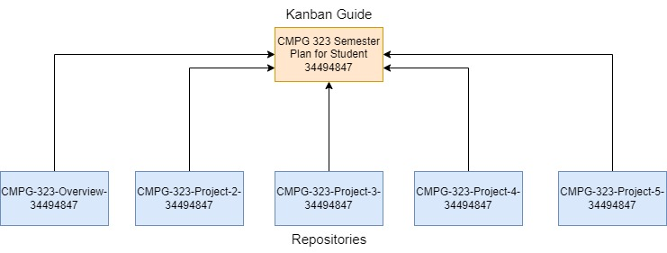

<h2>Project Structure</h2>

For each project, a new repository will be created, meaning there will be five completed repositories by the end of the semester. The links to each of the repositories are: 
    <ul>
        <li><a href="https://github.com/MarcelloClaud/CMPG-323-Overview-34494847">CMPG-323-Overview-34494847</a></li>
        <li><a href="https://github.com/MarcelloClaud/CMPG-323-Project-2-34494847">CMPG-323-Project-2-34494847</a></li>
        <li><a href="https://github.com/MarcelloClaud/CMPG-323-Project-3-34494847">CMPG-323-Project-3-34494847</a></li>
        <li><a href="https://github.com/MarcelloClaud/CMPG-323-Project-4-34494847">CMPG-323-Project-4-34494847</a></li>
        <li><a href="https://github.com/MarcelloClaud/CMPG-323-Project-5-34494847">CMPG-323-Project-5-34494847</a></li>
    </ul>
    The following diagram indicates the project structure that I will be using for each project, all repositories refer back to one Kanban Guide (Project feature on Github) as follow:
    

<h2>Issues (Milestones and Labels)</h2>
Due to the nature of my project structure as discussed previously, each repository will have its own issues. For example, CMPG-323-Overview-34494847 will have a milestone called Project 1 Submission, and CMPG-323-Project-2-34494847 will have a milestone called Project 2 Submission etc. But, every repository will have the same labels namely project, class, and training and in the Kanban guide, each task is assigned to a label of its respective repository destination. The purpose of this explanation is to let the reader not have to wonder why there are not six total milestones in my CMPG-323-Overview-34494847 repository.

<h2>Branching Strategy</h2>

There will only be three branches because these projects are individual, the Feature branch is where I will add new code and merge that code with the Master branch, in simple terms the Master branch indicates "the final product", the Bugfix branch is where I will be fixing issues that might occur from the current code from the Master branch.   
The following diagram indicates the branching strategy that I will be using for each project:

<h2>Login Credentials and .gitignore</h2>
<The>On Azure, due to security reasons, the connection string must also contain the login credentials to use the database on the server. The connection string that also contains the login credentials will be stored in a .json file, but a .gitignore file will be used to not keep track of the .json file otherwise anyone can access my database which means there will be virtually no security.

